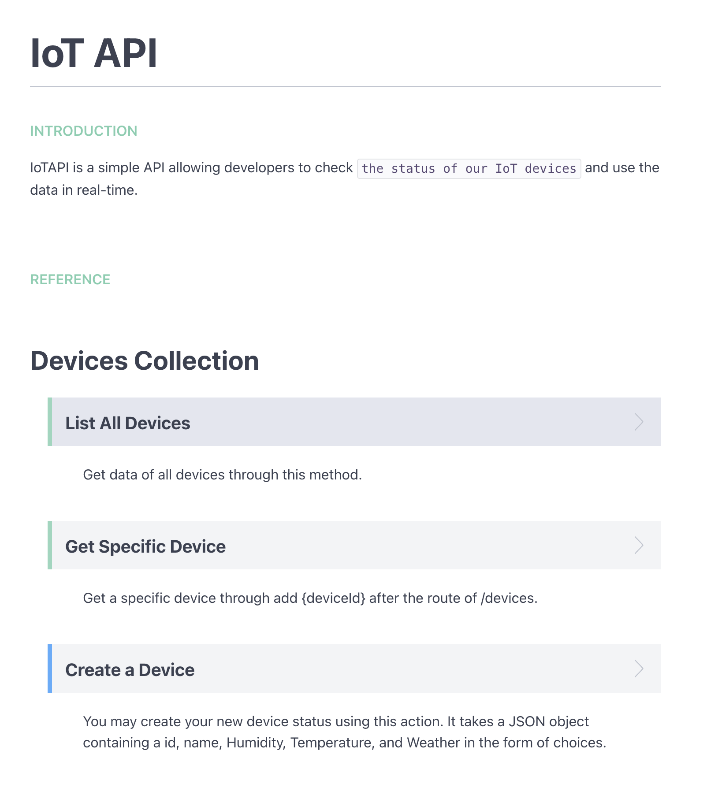
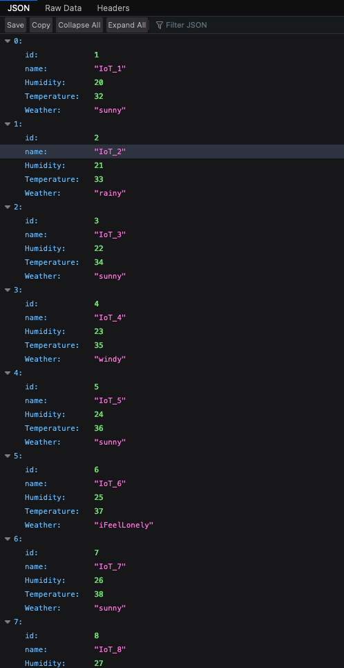
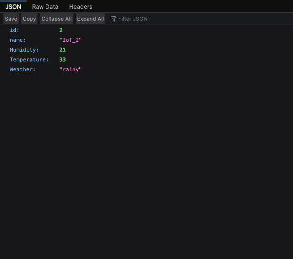

# IoT-API

> Creating a API for IoT devices

`API Documentation`
https://chunyuloandylo.docs.apiary.io/#reference

---

`The Link below is the API entrance of our IoT devices`
https://iotapinodejs.herokuapp.com/

`All Devices Data`
https://iotapinodejs.herokuapp.com/devices

####Specific Device :
######Example: Device 02 https://iotapinodejs.herokuapp.com/devices/2

